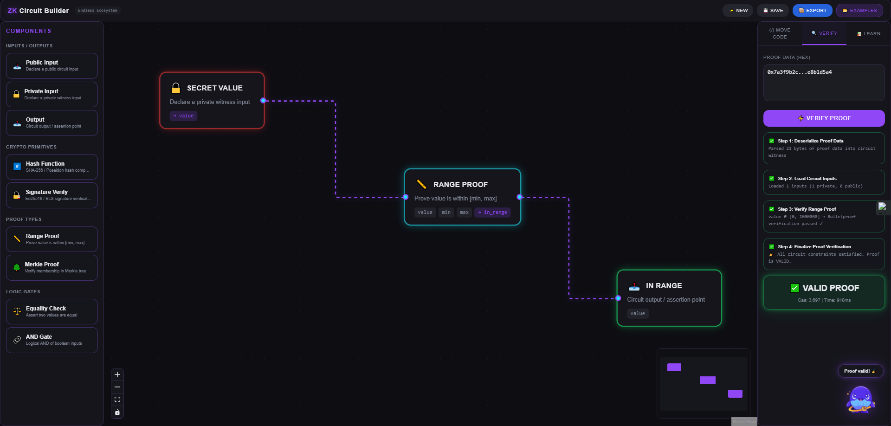

# Move ZK Circuit Builder & Verifier

A visual, interactive web-based PoC tool that helps developers design, build, and test Zero-Knowledge circuits using the Move language on the Endless ecosystem.

**Live Demo:** https://move-zk-circuit-builder-verifier.vercel.app/



## What It Does
This tool provides a drag-and-drop visual interface to:
- Build ZK circuits using modular components (Hash, Signature, Range Proof, Merkle Proof, etc.)
- Automatically generate the corresponding Move language code for the circuit
- Simulate proof verification on a mock Move VM (input proof data → see "Valid Proof" or "Invalid" with step-by-step explanation)
- Export the full Move contract + frontend integration example (ready for Luffa mini-apps)
- Includes built-in examples and a mini tutorial panel for learning ZK in Move

## Why It Matters to the Endless Ecosystem
- **Lowers the barrier for ZK development**: Visual builder makes zero-knowledge proofs much more accessible for both new and experienced Move developers.
- **Advances privacy innovation**: Helps builders experiment with ZK circuits for private voting, anonymous credentials, and privacy-preserving features in Luffa and beyond.
- **Educational impact**: Bridges the gap between theory and practice – developers can see real Move code generated from their visual design.
- **High strategic value**: Supports Endless’s roadmap in privacy, scalability, and advanced cryptography (ZK proofs, consensus improvements).

## Features (MVP)
- Drag & drop circuit builder with real-time Move code generation
- Mock ZK proof verifier with detailed feedback
- Built-in example circuits (Hash Proof, Range Check, Merkle Membership)
- Responsive dark-mode UI with neon accents (Endless aesthetic)
- Export Move contract + integration guide
- Pure React + Tailwind CSS + Framer Motion – clean and extensible

## How to Run / Test
1. Clone the repo:
   ```bash
   git clone https://github.com/duchth1993/Move-ZK-Circuit-Builder-Verifier.git
   
2. Install dependencies:
   ```bash
   npm install
   
3. Run locally:
   ```bash
   npm run dev
   
4. Or visit live demo: https://move-zk-circuit-builder-verifier.vercel.app/

## Future Improvements
- Real ZK-SNARKS integration (snarkjs or similar)
- Direct deployment to Endless testnet
- Save/load circuits to GitHub
- Integration with Luffa mini-app templates
- Advanced circuit debugging tools

## Built for:
Endless Monthly Contribution Program for Developers
Submission for: March 2026 cycle
@EndlessProtocol @EndlessDevTeam #EndlessDev
Made with  for accessible zero-knowledge development on Endless
Repo: https://github.com/duchth1993/Move-ZK-Circuit-Builder-Verifier


